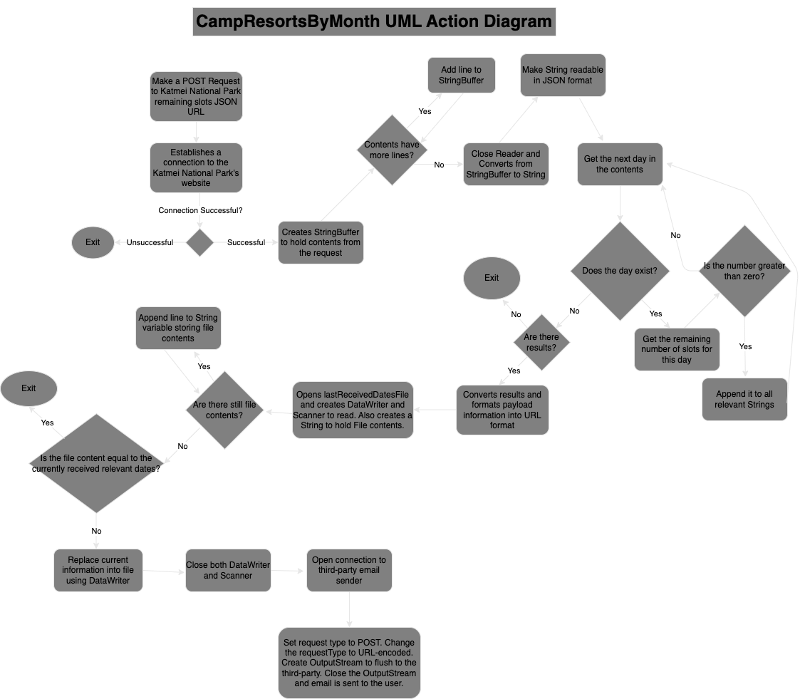

# AvailableCampSlots_KatmaiNationalPark

  Have you ever wanted to attend an event or book a reservation, but no slots are available? This repo is just for you! By checking every five minutes, CampResortsByMonth.java is able to notify you if there is availability for the Katmai national park. It sends you an email if there is a new slot that is available for you. You can run this at anytime as long as your device is on!

  This repository holds two files: CampResortsByMonth.java and lastReceivedDates.txt. CampResortsByMonth repeatedly makes a POST request depending on the Thread.sleep argument. 

  To run this locally on your device, you will need to change a few lines of CODE in order to allow it to work for your benefit. The following are variables / lines that are important to keep in mind:

Line 18: The year and month you want to track. Format must follow YYYY-MM, or else POST requests will fail.

Line 29: Thread.sleep will determine how frequent your requests are made. The greater the Integer value that's given, the less the frequency of requests made.

Line 142: This if statement is more for my personal goals. It filters out all dates that are not the 13th, 14th, or 15th of the month. This statement is completely optional and can be removed to keep all days of the month.

Line 160: payloadInfo MUST be in URL format because the format that is accepted later on is URL encoded. This line holds all of the information you will be sending.

Note: Line 166 - lastReceivedDates.txt must be in your source folder. This can be changed to your desired location, however. But make sure the text file is correctly located. If this is your very first time using this program, it's best to leave the text file empty. Do not edit this file at all as it prevents duplicate emails from being sent to you.

Line 201: MUST BE CHANGED. You can easily get your own third-party key from FormSpree in order to receive emails for your own personal account. If this link is not changed, the information is sent to me instead and you won't receive any notifications. 

This is every important piece of information that can be changed for your liking. Something to note is that your device must remain on in order to keep running this file. If there are remaining slots, you will receive a notification through your email.

  
